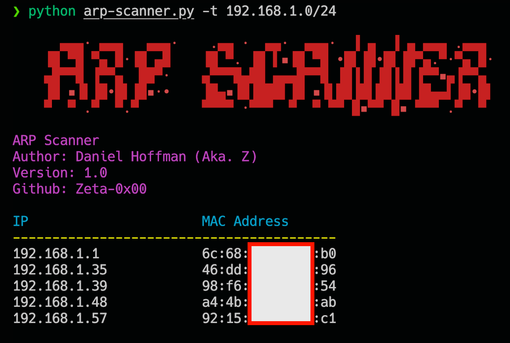

# ARP-Scanner
 Simple Usefull ARP Scanner made in Python with Scapy


# Requirements
- Python 3.6+
- Scapy
- Termcolor

# Installation
```bash
pip install -r requirements.txt
```
Understanding Scapy

Check [Github Scapy.scapy.plist](https://github.com/secdev/scapy/blob/8d35918b0847e57388a9418748f7d17c2da8925d/scapy/plist.py#L193)
To understand the Scapy's packet list and how to use it.

This is as simples as just use the `packet.summary()` method to get a summary of the packet. But if you read the function code, you will notice that it has 2 arguments `pnr` and `lfilter`. The `pnr` is a function that will be called for each packet and the `lfilter` is a function that will be called to filter the packets.

So Understanding this, we can use the `prn` argument to print the packet in a custom way. Like this:
```python
packet.summary(prn=lambda pkt: f"Source: {pkt[1].psrc}, Destination: {pkt[1].pdst}, MAC: {pkt[1].hwsrc}")
```

So this is just one option, for this arp-scanner, I made something diferent, I made a list comprehension to get packet by packet and create my own string to print in another function, just to let the code more clean and scalable.

# Usage
```haskell
python arp-scanner.py -t 192.168.1.0/24
```

